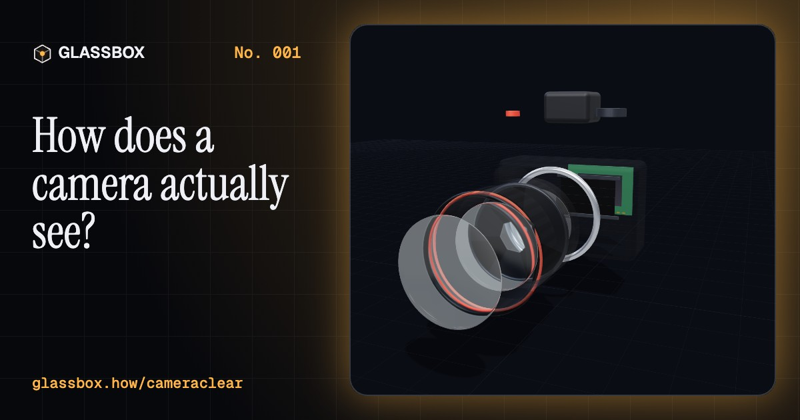
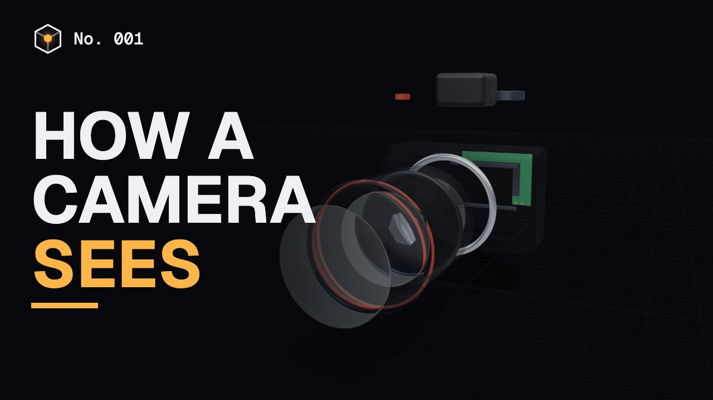
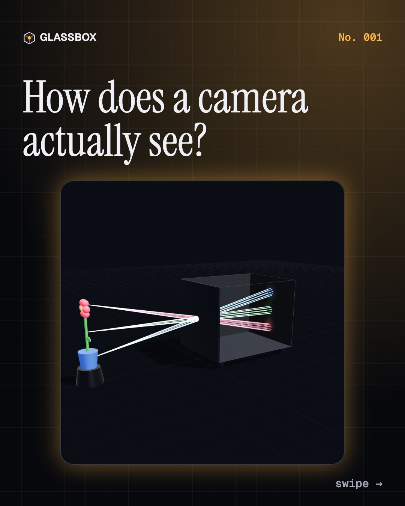
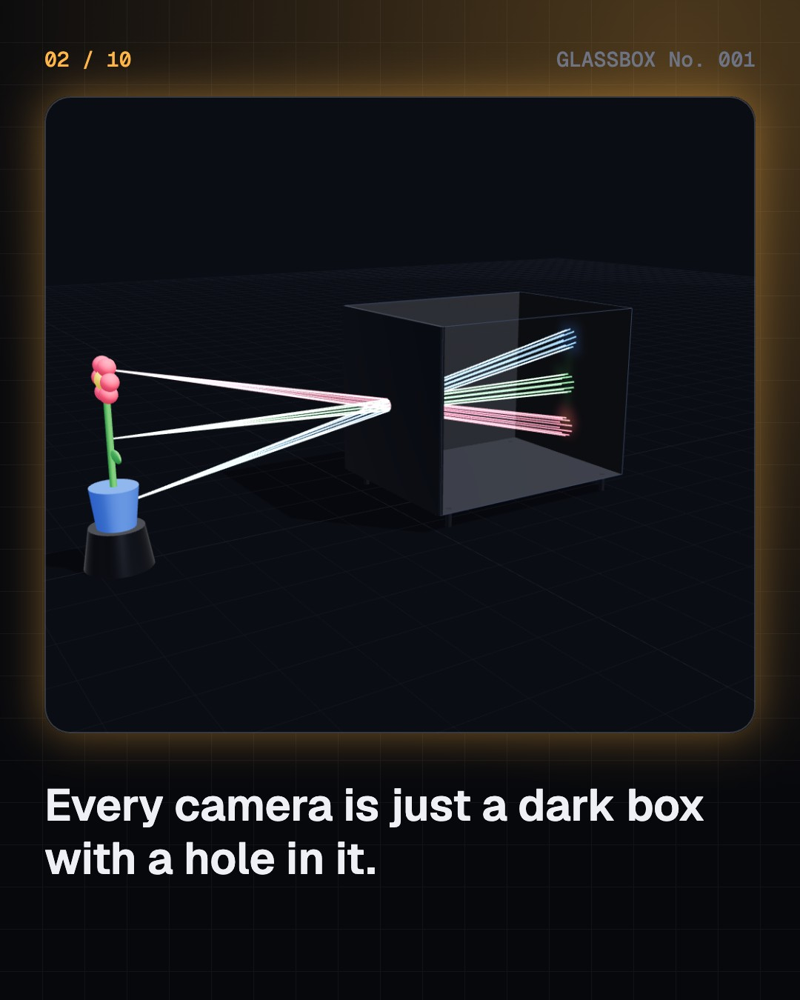
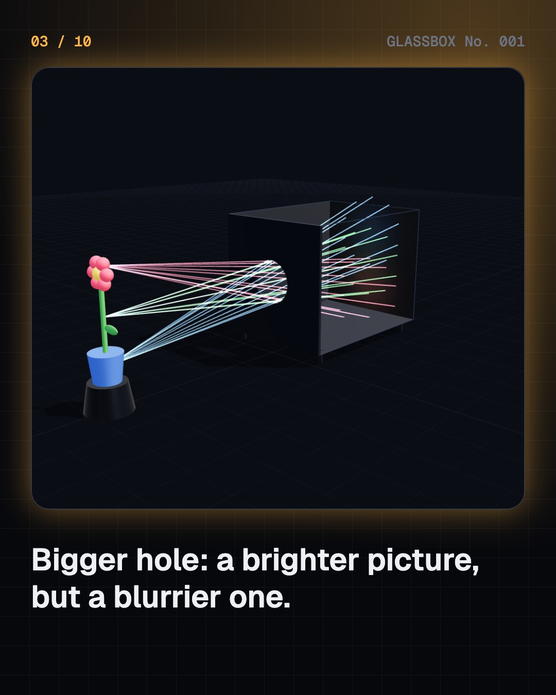
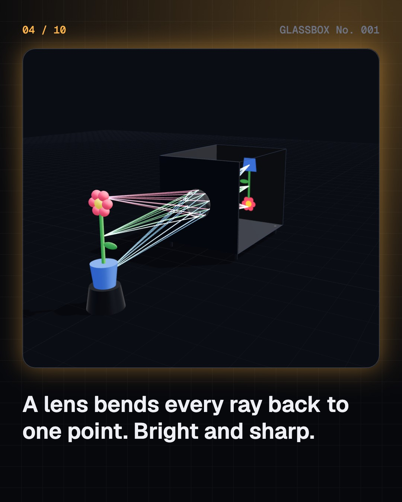

<!-- glassbox:start -->
<!-- Generated from glassbox.json by the Glassbox hub (npm run readme -- cameraclear). Edit glassbox.json, not this block. -->
<p align="center"><a href="https://glassbox.how/e/cameraclear/"></a></p>

<h1 align="center">CameraClear</h1>

<p align="center"><b>How does a camera actually see?</b><br>A dark box, a hole, and an upside-down world. Take a real camera apart in 3D and learn what aperture, shutter speed and ISO really do.</p>

<p align="center"><a href="https://glassbox.how/cameraclear/"><b>▶ Play with it</b></a> &nbsp;·&nbsp; <a href="https://glassbox.how/e/cameraclear/">Read the 60-second explainer</a> &nbsp;·&nbsp; <a href="https://glassbox.how/cameraclear/glassbox/reel.mp4">Watch the 40-second video</a></p>

<p align="center">
  <a href="https://glassbox.how/e/cameraclear/"></a>
  <a href="https://glassbox.how/e/cameraclear/"></a>
  <a href="LICENSE"></a>
  <a href="LICENSE-CONTENT.md"></a>
  <a href="#privacy"></a>
</p>

## In 60 seconds

1. **Every camera is a dark box with a hole.** Light travels in straight lines. A small hole lets only a thin bundle of rays through from each point of a scene, so they paint a picture on the back wall. It lands upside-down because rays from the top cross over to the bottom.
2. **A lens fixes the pinhole's trade-off.** A bigger hole gives a brighter picture but a blurrier one. A lens bends every ray from one point back to one point, so you get a wide opening that is still sharp. Focusing means moving the lens until those rays meet exactly on the sensor.
3. **Aperture is how wide the door opens.** Iris blades set the size of the opening. A wide aperture (f/2) lets in lots of light and blurs the background. A narrow one (f/16) lets in little light and keeps near and far sharp. That in-focus zone is the depth of field.
4. **Shutter speed is how long the door stays open.** Two curtains slide across the sensor. A fast shutter (1/1000 s) freezes motion. A slow one (1/15 s) collects more light but smears anything that moves, including your own shaking hands.
5. **ISO turns up the volume, and the noise.** The sensor counts photons in millions of tiny wells. ISO amplifies that signal after the fact. It brightens a dark photo, but it amplifies the random grain too.
6. **Exposure is the three working together.** Aperture, shutter speed and ISO all trade against each other. Close the aperture one stop and you need twice the shutter time, or twice the ISO, for the same brightness. Every photo is a choice about which side effect you'd rather have.

## Words worth knowing

| Term | Meaning |
|---|---|
| **Camera obscura** | Latin for 'dark room': a sealed space with a small hole that projects an upside-down image of the outside world. |
| **f-number** | Focal length divided by aperture diameter. Smaller numbers mean bigger openings: f/2 lets in 4x the light of f/4. |
| **Stop** | A doubling or halving of light. Photographers measure every exposure change in stops. |
| **Depth of field** | The distance range that looks acceptably sharp. Wide apertures, long lenses and close subjects make it shallow. |
| **Focal length** | How strongly a lens bends light, in millimetres. Short = wide view, long = narrow, magnified view. |
| **Sensor noise** | Random speckle from the physics of counting light. ISO amplification makes it more visible. |

## A short history

**2,400 years from a hole in the wall to the camera in your pocket.**

- **400 BCE** · The first written description of a pinhole image (Mozi and the Mohists, China)
- **1021** · Experiments with a dark room and candles (Ibn al-Haytham (Alhazen), Cairo, Egypt)
- **1568** · The first aperture (Daniele Barbaro, Venice, Italy)
- **1827** · The oldest surviving photograph (Nicéphore Niépce, Saint-Loup-de-Varennes, France)
- **1839** · Photography is given to the world (Louis Daguerre, Paris, France)
- **1840** · A lens fast enough for portraits (Joseph Petzval, Vienna, Austria)
- **1861** · The first colour photograph (James Clerk Maxwell and Thomas Sutton, London, England)
- **1878** · The horse in motion (Eadweard Muybridge, Palo Alto, California, USA)

The full story, with 50 moments, charts, people and 21 sources: [glassbox.how/e/cameraclear/history](https://glassbox.how/e/cameraclear/history/). The data lives in [`history.json`](history.json).

## Video and slides

Made with the Glassbox studio from this box's storyboard (`window.glassbox.director`). Free to reuse under CC BY 4.0.

<a href="https://glassbox.how/cameraclear/glassbox/video.mp4"></a>

<p><a href="glassbox/slide-1.jpg"></a> <a href="glassbox/slide-2.jpg"></a> <a href="glassbox/slide-3.jpg"></a> <a href="glassbox/slide-4.jpg"></a></p>

| File | What | Size |
|---|---|---|
| [`glassbox/reel.mp4`](https://glassbox.how/cameraclear/glassbox/reel.mp4) | Reel / Short, with captions and soundtrack | 1080×1920 |
| [`glassbox/video.mp4`](https://glassbox.how/cameraclear/glassbox/video.mp4) | YouTube video, with captions and soundtrack | 1920×1080 |
| `glassbox/slide-1…10.jpg` | Instagram carousel | 1080×1350 |
| `glassbox/thumb.jpg` | YouTube thumbnail | 1280×720 |
| `glassbox/cover.jpg` | Share card and repo social preview | 1200×630 |
| [`glassbox/history-reel.mp4`](https://glassbox.how/cameraclear/glassbox/history-reel.mp4) | “History in 10 moments” Reel / Short | 1080×1920 |
| `glassbox/history-slide-*.jpg` | History carousel | 1080×1350 |
| `glassbox/post.json` | Post copy and schedule used by the publish kit | |

## Privacy

This box has no accounts and no ads, and it ships its own fonts and libraries. When you run it yourself it sends nothing anywhere. On glassbox.how, the site's `/bar.js` also loads Glassbox's analytics: **Google Analytics** to count visits (it asks first in the EU, UK and Switzerland, and stays off when your browser sends Global Privacy Control or Do Not Track) and **ClickTrust** to detect bots.

It remembers a few things **in your own browser only**, and never sends them anywhere:

| Browser storage key | What it holds |
|---|---|
| `cameraclear.v1` | Your XP, finished missions, best quiz scores, whether you have seen the welcome screen, and sound on or off. |

Exactly what each one sees is at [glassbox.how/privacy](https://glassbox.how/privacy/).

## Licences

- **Code:** [MIT](LICENSE). Use it, change it, ship it.
- **Explanations, text, images and videos** (`glassbox.json`, `glassbox/`): [CC BY 4.0](LICENSE-CONTENT.md). Credit “Glassbox, glassbox.how/e/cameraclear”.
- **Third-party parts** keep their own licences: [three.js](https://threejs.org) (MIT), [Inter, JetBrains Mono, Space Grotesk](https://openfontlicense.org) (SIL OFL 1.1).
- The Glassbox name and logo aren't covered by either licence. See the [terms](https://glassbox.how/terms/).

Found a mistake? [Open an issue](https://github.com/bdeeps/cameraclear/issues). Corrections happen in public.
<!-- glassbox:end -->

## About the app

An interactive 3D game that teaches how cameras work: light, lenses, focus, aperture,
shutter speed, ISO, exposure, focal length and depth of field.

Each chapter has:

- a **3D model** you can orbit, zoom and poke (Three.js)
- **sliders** that drive the model live
- a **simulated camera screen** that renders a small outdoor scene with real depth of field,
  motion blur, camera shake, exposure and ISO noise. Tap it to focus, press the red button (or Space) to shoot
- **missions** that earn XP, a **quiz**, and **definitions** for every term

## Run it

```bash
npm start
```

Then open http://localhost:5173. (`npm start` runs `python3 serve.py`, a static server with caching turned off.
Any static server works; ES modules just need to be served over http, not opened as `file://`.)

Everything is self-contained: three.js (`vendor/three/`) and the fonts (`fonts/`) ship in the repo, so it works offline and, run locally, never contacts another site.

## Chapters

| # | Chapter | 3D model |
|---|---------|----------|
| 1 | How a Camera Sees | Camera obscura: rays through a pinhole, upside-down image, add a lens |
| 2 | Anatomy of a Camera | A camera that explodes into parts you can click |
| 3 | Focus | Ray diagram with a moving lens, blur circle, plane of focus, 1/f = 1/u + 1/v |
| 4 | Aperture | Iris blades that open and close, light particles passing through |
| 5 | Shutter Speed | Focal-plane shutter curtains in slow motion (including the travelling slit) |
| 6 | ISO & the Sensor | Photosite wells filling with photons, Bayer filter, gain, noise, clipping |
| 7 | Exposure Triangle | The bucket analogy: tap width, how long it runs, bucket size |
| 8 | Focal Length & FOV | The world, with the camera's field-of-view pyramid |
| 9 | Depth of Field | The in-focus zone drawn into the world |
| 10 | Pro Mode | Full manual control and six photo assignments |

## Code map

- `js/app.js`: shell, game state (XP, missions, quiz), camera screen, main loop
- `js/stage.js`: the 3D stage (renderer, orbit controls, labels, picking)
- `js/photosim.js`: the simulated camera (DOF shader, sub-frame motion blur, exposure, noise)
- `js/world.js`: the outdoor scene the camera photographs, plus the light presets
- `js/optics.js`: exposure, DOF, FOV and blur maths
- `js/chapters/*.js`: one file per chapter (text, controls, missions, quiz, 3D build)
- `js/glossary.js`: every definition

Progress is saved in `localStorage`. `window.cameraclear` exposes the stage and settings for debugging.

